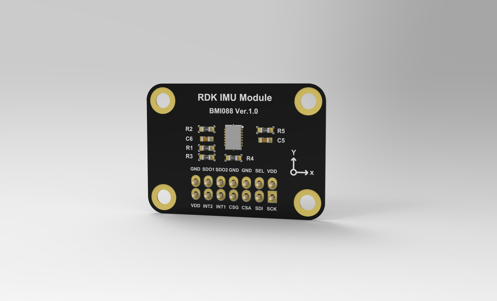
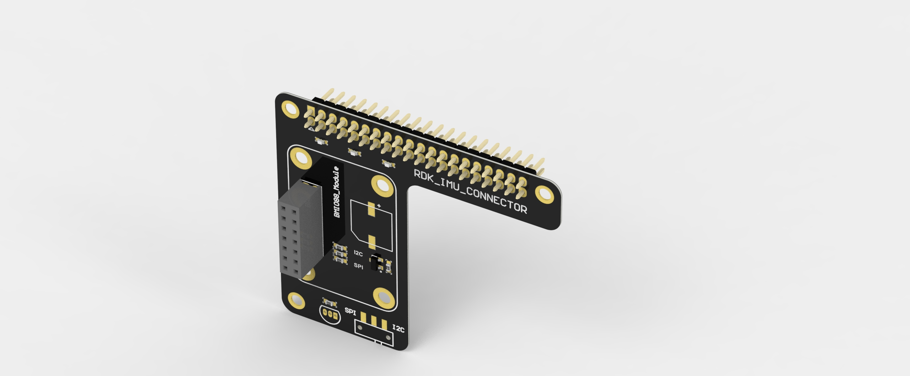
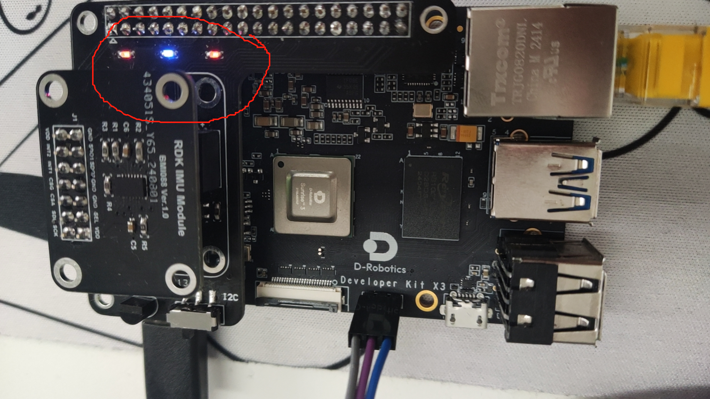
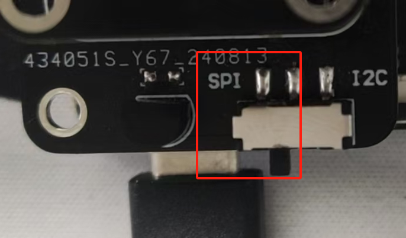
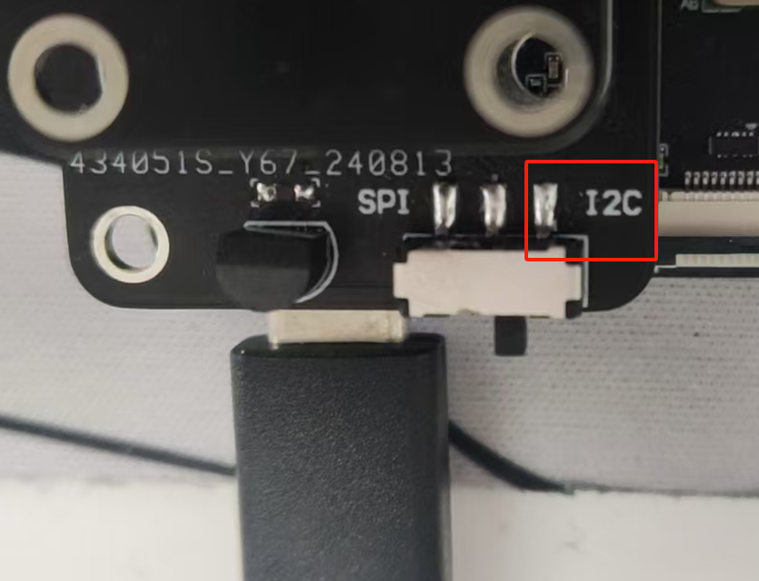
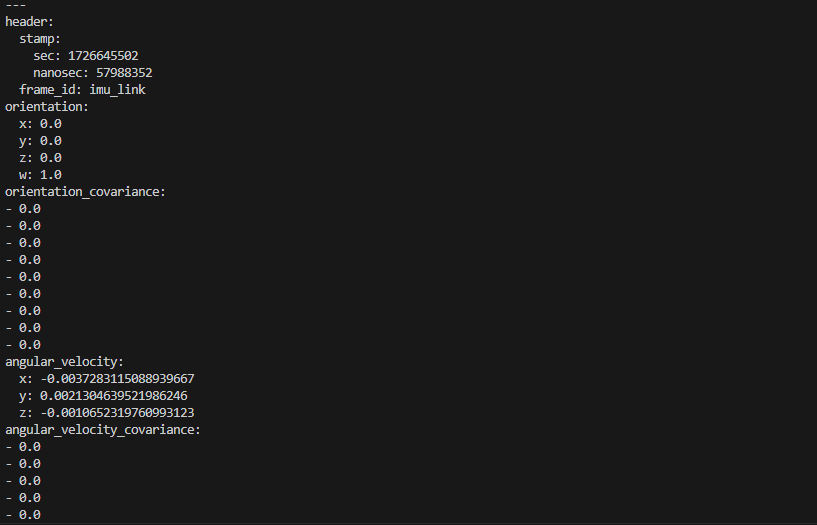
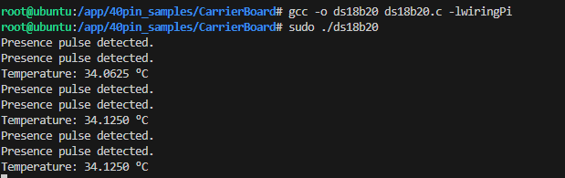

# RDK X3 Carrier Board 使用手册

- [RDK X3 Carrier Board 使用手册](#rdk-x3-carrier-board-使用手册)
  - [1. 简介](#1-简介)
  - [2. GPIO 外设测试](#2-gpio-外设测试)
  - [3. BMI088 SPI 读取方式](#3-bmi088-spi-读取方式)
  - [4. BMI088 i2c 读取方式](#4-bmi088-i2c-读取方式)
  - [5. DS18B20 温度传感器读取方式](#5-ds18b20-温度传感器读取方式)

## 1. 简介

rdk_imu 仓库是专为使用 RDK_IMU_MODULE 模组及 RDK_IMU_CONNECTOR 载板的开发者设计的驱动仓库，支持在 RDK X3/X5 系列开发板上快速实现 GPIO、SPI、I2C 等接口外设的控制与驱动。该仓库提供对 BMI088 陀螺仪/加速度计的完整数据读取和处理功能，方便开发者在项目中轻松集成传感器数据采集。通过简易的 API 和示例代码，用户可以快速上手并实现对传感器数据的高效读取与分析，适用于多种物联网和嵌入式应用场景

**RDK_IMU_MODULE 示意图**：



**RDK_IMU_CONNECTOR 示意图**：



## 2. GPIO 外设测试

GPIO 外设可以通过 Python 或 C 语言进行测试，具体操作步骤如下：t

**Python 测试**：

1. **使用 root 用户登录开发板**： 确保以 root 用户身份登录开发板，以获得对 GPIO 引脚的控制权限。
2. **执行测试脚本**： 运行 test_GPIO.py 脚本，该脚本会控制蜂鸣器和 LED，验证是否能够正常工作。

```Python
python test_GPIO.py
```

执行后，蜂鸣器应发出响声，LED 指示灯将点亮，表示 GPIO 外设功能正常。

**C 语言测试**：

1. **编译 wiringPi**： 先确保已经安装好 wiringPi，确保可以直接读取 GPIO 口的状态。可以使用如下命令编译 wiringPi：

```shell
git clone https://gitee.com/study-dp/WiringPi.git
cd WiringPi
./build
gpio readall
```

执行成功后，命令行会显示管脚pin口列表：

```shell
root@ubuntu:/app/40pin_samples# gpio readall
 +-----+-----+-----------+-RDK X3v2-+-----------+-----+-----+
 | BCM | xPi |    Name   | Physical |   Name    | xPi | BCM |
 +-----+-----+-----------+----++----+-----------+-----+-----+
 |     |     |      3.3v |  1 || 2  | 5v        |     |     |
 |   2 |   9 |     SDA.0 |  3 || 4  | 5v        |     |     |
 |   3 |   8 |     SCL.0 |  5 || 6  | 0v        |     |     |
 |   4 | 101 | I2S0_MCLK |  7 || 8  | TxD.3     | 111 | 14  |
 |     |     |        0v |  9 || 10 | RxD.3     | 112 | 15  |
 |  17 |  12 |  GPIO. 17 | 11 || 12 | I2S0_BCLK | 102 | 18  |
 |  27 |  13 |  GPIO. 27 | 13 || 14 | 0v        |     |     |
 |  22 |  30 |  GPIO. 22 | 15 || 16 | GPIO. 23  | 27  | 23  |
 |     |     |      3.3v | 17 || 18 | GPIO. 24  | 22  | 24  |
 |  10 |   6 | SPI1_MOSI | 19 || 20 | 0v        |     |     |
 |   9 |   7 | SPI1_MISO | 21 || 22 | GPIO. 25  | 29  | 25  |
 |  11 |   3 | SPI1_SCLK | 23 || 24 | SPI1_CSN  | 5   | 8   |
 |     |     |        0v | 25 || 26 | GPIO.  7  | 28  | 7   |
 |   0 |  15 |     SDA.3 | 27 || 28 | SCL.3     | 14  | 1   |
 |   5 | 119 |   GPIO. 5 | 29 || 30 | 0v        |     |     |
 |   6 | 118 |   GPIO. 6 | 31 || 32 | PWM4      | 25  | 12  |
 |  13 |   4 |      PWM0 | 33 || 34 | 0v        |     |     |
 |  19 | 103 | I2S0_LRCK | 35 || 36 | GPIO. 16  | 20  | 16  |
 |  26 | 117 |   GPIO.26 | 37 || 38 | I2S1_SDIO | 108 | 20  |
 |     |     |        0v | 39 || 40 | I2S0_SDIO | 104 | 21  |
 +-----+-----+-----------+----++----+-----------+-----+-----+
 | BCM | xPi |    Name   | Physical |   Name    | xPi | BCM |
 +-----+-----+-----------+-RDK X3v2-+-----------+-----+-----+
 ```

2. **编译 C 语言测试代码**：在项目目录下编译提供的 C 代码。可以使用如下命令编译测试程序：

```shell
gcc -o test_GPIO test_GPIO.c -lwiringPi
```

此命令将 test_GPIO.c 编译为可执行文件 test_GPIO，并链接所需的 WiringPi 库

3. **运行测试程序**：在编译完成后，通过以下命令运行测试程序：

```shell
sudo ./test_GPIO
```

程序运行后，蜂鸣器和 LED 指示灯将按照程序设定的逻辑进行操作，验证 GPIO 引脚的工作状态。



**注意事项**
- **权限要求**： 使用 GPIO 进行硬件控制时，务必以 root 用户身份操作，否则可能会因为权限不足导致操作失败。
- **开发环境**： Python 测试需要在开发板上安装相应的 Python 环境和依赖库。C 语言测试则需要确保安装 WiringPi 库。

## 3. BMI088 SPI 读取方式

在使用 SPI 接口读取 BMI088 传感器数据之前，请先进行以下操作：

1. **拨码开关设置**：确保将开发板上的拨码开关切换到 SPI 一侧，以启用 SPI 接口。拨码开关的位置如下图所示：



2. **执行 Python 测试脚本**：切换拨码开关后，可以运行 test_BMI088.py 脚本来读取传感器数据。该脚本通过 SPI 接口驱动 BMI088 传感器并获取加速度计和陀螺仪的数据。

```Python
python3 test_BMI088_SPI.py
```

如果配置正确，脚本会输出从 BMI088 传感器读取的实时数据，验证 SPI 接口正常工作。

**注意事项**：
- **SPI 接口设置**： 使用 SPI 接口时，必须确保拨码开关切换正确，否则可能导致无法读取到有效数据。
- **依赖库**： 请确认已安装必要的 Python 库和驱动，以确保脚本正常运行。

## 4. BMI088 i2c 读取方式

在使用 I2C 读取 BMI088 传感器数据之前，请确保完成以下操作步骤：

1. **拨码开关设置**：

首先，将开发板上的拨码开关切换到 I2C 一侧，启用 I2C 通信接口。拨码开关位置如下图所示：



2. **编译可执行文件**：

执行以下命令获取项目 IMU 驱动代码并编译 I2C 传感器驱动：

```shell
git clone https://github.com/D-Robotics/hobot_imu_sensor.git
cd hobot_imu_sensor
source /opt/tros/setup.bash
pip install -U colcon-common-extensions
colcon build --packages-select imu_sensor
```

上述命令会从 GitHub 拉取代码库，并使用 colcon 工具构建 imu_sensor 包

3. **安装驱动模块**：

进入 imu 文件夹后，执行以下命令，将编译好的模块安装到系统中：

```shell
dpkg -i hobot-*.deb
cp bmi088.ko /lib/modules/4.14.87
```

4. **加载驱动并启动 ROS2 节点**：

重新上电后，执行以下步骤来加载 BMI088 模块并启动 ROS2 节点：

**在终端1**：

```shell
depmod -a 
modprobe bmi088
source /opt/tros/setup.bash
source hobot_imu_sensor/install/setup.bash
ros2 launch imu_sensor imu_sensor.launch.py
```

该操作将会启动 imu_sensor 节点，驱动 BMI088 传感器并开始发布传感器数据。

5. **查看 IMU 数据**：

在另一个终端（终端2）中，使用以下命令订阅并查看 IMU 数据：

```shell
source /opt/tros/setup.bash
ros2 topic echo /imu_data
```

正常情况下，终端2将会显示 BMI088 传感器的实时数据输出，如下图所示：



**注意事项**：
- **I2C 接口设置**： 使用 I2C 读取传感器数据时，确保拨码开关已正确切换至 I2C 模式。
- **环境配置**： 确保系统已安装必要的 ROS2 环境、colcon 构建工具以及相关驱动程序


## 5. DS18B20 温度传感器读取方式

DS18B20 温度传感器可以通过编译并运行 C 代码来读取其温度数据，具体操作如下：：

1. **编译 DS18B20 代码**：

在终端中执行以下命令，使用 gcc 编译 DS18B20 温度传感器的 C 代码：

```shell
gcc -o ds18b20 ds18b20.c -lwiringPi
```

此命令将 ds18b20.c 文件编译为可执行文件 ds18b20，并链接所需的 WiringPi 库。

2. **运行可执行文件**：

编译成功后，通过以下命令运行生成的可执行文件并读取温度数据：

```shell
sudo ./ds18b20
```

运行成功后，终端将输出 DS18B20 传感器的实时温度数据，显示结果如下图所示：



**注意事项**
- 权限要求： 由于读取硬件数据需要更高的权限，请使用 sudo 命令运行可执行文件。
- 传感器连接： 确保 DS18B20 传感器正确连接到开发板上的 GPIO 引脚，并已添加适当的上拉电阻（已硬件上拉）。